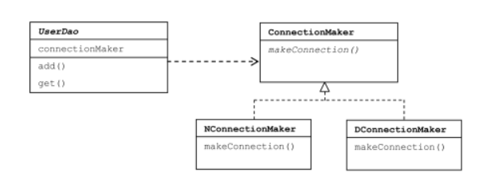
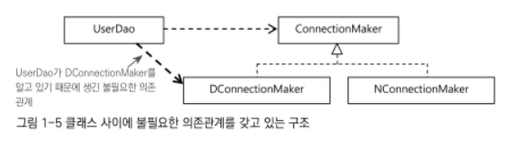

# 토비의 스프링


# 1. 스프링이란 무엇인가?

- 스프링 컨테이너 : 애플리케이션의 기본 틀

  스프링은 Spring Container, Application Context 라고도 불리는 스프링 런타임 엔진을 제공.

  Spring Container는 설정정보를 참고로 해서 애플리케이션을 구성하는 오브젝트를 생성, 관리.

- 공통 프로그래밍 모델

  - IoC/DI : 오브젝트의 생명주기와 의존관계에 대한 프로그래밍 모델.

    스프링 프레임워크에서 동작하는 코드는 IoC/DI 방식을 따라서 작성돼어야 스프링이 제공하는 가치를 제대로 누릴 수 있다.

    스프링이 제공하는 모든 기술, API, 컨테이너는 IoC/DI 방식으로 작성돼 있다. 스프링을 이해하는 기본, 중요한 기술.

  - 서비스 추상화 : 특정 환경, 서버에 종속되지 않고 이식성이 뛰어나며 유연한 어플리케이션을 만들 수 있다.

  - AOP : 스프링은 AOP를 이용해서 다양한 엔터프라이즈 서비스를 적용하고도 깔끔한 코드를 유지할 수 있게 해준다.


# 2. 스프링의 성공 요인

- 단순함 : 자바가 복잡해지며 객체지향 언어라는 특징을 점점 잃어버리게 되었으나 -> 스프링은 객체지향 언어의 장점을 살릴 수 있도록 도와주는 도구.

  -> POJO 프로그래밍

- 유연성 : 스프링의 유연성으로 인해 다른 프레임워크와도 편리하게 접목돼어 사용가능.


# 3. 스프링 3.1에 추가된 기능

- 강화된 자바 코드를 이용한 빈 설정

  기존에 XML로 작성했던 스프링 설정 정보를 자바 코드로 대체할 수 있다.

- 런타임 환경 추상화

  실행환경에 따라 달라지는 빈 설정을 효과적으로 관리할 수 있는 프로파일,

  각종 프로퍼티 정보를 컨테이너를 통해 일관된 방식으로 제공할 수 있게 해주는 프로퍼티 소스.

- JPA 지원 확장, 하이버제이트 4 지원.

- 새로운 DispatcherServlet 전략, 플래시 맵

  MVC 기능을 확장하기가 편리해짐. Post/Redirect/Get 패턴에 사용할 수 있는 플래시 맵 기능도 추가.

- 캐시 추상화

  AOP를 이용한 메소드 레벨의 캐시 추상화 기능 추가.


# 4. DAO

- JDBC를 이용하는 작업의 일반적 순서
  1. DB 연결을 위한 Connection을 가져온다.
  2. SQL을 담은 Statement(또는 PreparedStatement)를 만든다.
  3. 만들어진 Statement실행.
  4. 조회의 경우, SQL 쿼리의 실행 결과를 ResultSet으로 받아서 정보를 저장할 오브젝트에 옮겨준다.
  5. Connection, Statement, ResultSet 같은 리소스는 작업을 마친 후 반드시 닫는다.
  6. JDBC API가 만들어내는 Exception은 직접 처리하거나 메소드 밖으로 던지게 한다.

```java
package dao;

import domain.User;

import java.sql.*;

public class UserDao {
    public void add(User user) throws ClassNotFoundException, SQLException {
        Class.forName("com.mysql.cj.jdbc.Driver");
        Connection c = DriverManager.getConnection(
                "jdbc:mysql://localhost/study_db?serverTimezone=UTC",
                "root",
                "1234"
        );

        PreparedStatement ps = c.prepareStatement(
                "insert into users(id, name, password) " +
                        "values(?,?,?)"
        );

        ps.setString(1, user.getId());
        ps.setString(2, user.getName());
        ps.setString(3, user.getPassword());

        ps.executeUpdate();

        ps.close();
        c.close();
    }

    public User get(String id) throws ClassNotFoundException, SQLException {
        Class.forName("com.mysql.cj.jdbc.Driver");
        Connection c = DriverManager.getConnection(
                "jdbc:mysql://localhost/study_db?serverTimezone=UTC",
                "root",
                "1234"
        );

        PreparedStatement ps = c.prepareStatement(
                "select * from users where id = ?"
        );

        ps.setString(1, id);

        ResultSet rs = ps.executeQuery();
        rs.next();
        User user = new User();
        user.setId(rs.getString("id"));
        user.setName(rs.getString("name"));
        user.setPassword(rs.getString("password"));

        rs.close();
        ps.close();
        c.close();

        return user;
    }

    public static void main(String[] args) throws ClassNotFoundException, SQLException {
        UserDao dao = new UserDao();

        User user = new User();
        user.setId("whiteship");
        user.setName("백기선");
        user.setPassword("married");

        dao.add(user);

        System.out.println(user.getId() + " 등록 성공");

        User user2 = dao.get(user.getId());
        System.out.println(user2.getName());
        System.out.println(user2.getPassword());

        System.out.println(user2.getId() + " 조회 성공");
    }
}

```


# DAO 수정하기

- 관심사의 분리 : 변화는 한 가지에 집중돼서 일어난다.

  -> 관심사가 같은 것끼리 모아두는 것. 다른 것들은 따로 떨어뜨리는 것.

위의 UserDao 의 관심사항

- DB Connection
- SQL 문장을 만들고 실행하는 것
- 작업이 끝난 리소스를 Close 하는 것


### 첫번째 리팩토링. DB Connection 분리

```java
private Connection getConnection() throws ClassNotFoundException, SQLException {
        Class.forName("com.mysql.cj.jdbc.Driver");
        Connection c = DriverManager.getConnection(
                "jdbc:mysql://localhost/study_db?serverTimezone=UTC",
                "root",
                "1234"
        );

        return c;
    }
```

-> 공통의 기능을 담당하는 메소드로 중복된 코드를 추출 : 메소드 추출


```java
public abstract Connection getConnection() throws ClassNotFoundException, SQLException;
```

-> 추상 메서드로 상속을 통해 확장을 하도록 구현.

-> 같은 getConnection 메서드를 상황에 따라 다르게 구현해서 사용이 가능!

-> 슈퍼클래스에 기본적 로직의 흐름을 만들고, 그 기능의 일부를 서브클래스에서

필요에 맞게 구현하는 디자인 패턴 : 템플릿 메서드 패턴, 또는 팩토리 메서드 패턴


#### 템플릿 메소드 패턴

- 상속을 통해 슈퍼클래스의 기능을 확장하는 가장 대표적 방법
- 변하지 않는 기능은 슈퍼클래스에 만들고, 자주 변경, 확장되는 기능은 서브클래스에 만든다.
- 훅 메서드 : 슈퍼클래스에서 디폴트 기능을 정의하거나, 비워둠으로써 서브클래스에서 선택적으로 오버라이드할 수 있도록 만든 메서드.

```java
public abstract class Super {
    public void templateMethod() {
        // 기본 알고리즘 코드
        hookMethod();
        abstractMethod();
    }
    
    //선택적으로 오버라이드 가능한 훅 메서드
    protected void hookMethod() {}
    //서브클래스에서 반드시 구현해야 하는 추상 메서드
    public abstract void abstractMethod();
}
```


#### 팩토리 메소드 패턴

- 상속을 통해 기능을 확장 -> 템플릿 패턴과 비슷
- 슈퍼클래스에서는 서브클래스에서 구현할 메서드를 호출해서 필요한 타입의 오브젝트를 가져와 사용. 주로 오브젝트를 리턴하도록 만들어져서 서브클래스에서 어떤 타입으로 리턴할지는 관심을 두지 않는다.


상속의 문제점 : 슈퍼 클래스, 서브 클래스 간의 종속관계가 강하게 맺어져 있으므로 변경에 취약하게 됨.


# 클래스의 분리

```java
package dao;

import java.sql.Connection;
import java.sql.DriverManager;
import java.sql.SQLException;

public class SimpleConnectionMaker {
    public Connection getConnection() throws ClassNotFoundException, SQLException {
        Class.forName("com.mysql.cj.jdbc.Driver");
        Connection c = DriverManager.getConnection(
                "jdbc:mysql://localhost/study_db?serverTimezone=UTC",
                "root",
                "1234"
        );

        return c;
    }
}

```

-> 아예 다른 클래스로 빼버려서 DB Connection을 정의.

-> 이때, 발생하는 문제점

: 상속을 통해서는 N사, D사에 UserDao 클래스만 공급하고 상속을 통해 DB Connection을 확장해서 사용하게 했던 것이 불가능.

UserDao의 코드가 SimpleConnectionMaker 클래스에 종속돼버림. 즉, UserDao 코드의 수정없이 DB 커넥션 생성 기능을 변경하지 못함.

-> UserDao가 바뀔 수 있는 정보, 즉 DB 커넥션을 가져오는 클래스에 대해 너무 많이 알고 있기 때문. -> 인터페이스를 통해 해결.




```java
package dao;

import java.sql.Connection;
import java.sql.SQLException;

public interface ConnectionMaker {
    Connection getConnection() throws ClassNotFoundException, SQLException;
}

```

-> ConnectionMaker 라는 인터페이스를 만듦으로써 N사, D사가 UserDao의

코드 변경없이 가져다 쓸 수 있게 하고자 만드는 의도. But, 그러나


```java
private ConnectionMaker connectionMaker;

public UserDao() {
    connectionMaker = new NConnectionMaker();
}
```

UserDao 클래스를 생성할 때, 어떤 ConnectionMaker 타입을 가져와야 할지를 명시해야 하므로 여전히, D사가 가져다가 DConnectionMaker를 만들고 싶으면 코드를 수정해야 함.

-> 아직 UserDao 클래스 안에는 어떤 ConnectionMaker를 가져다 쓸 것인지에 대한 관심이 남아 있기 때문임.

즉, 다음과 같은 의존관계를 해결해야함.



UserDao의 모든 코드가 ConnectionMaker 인터페이스 외에는 어떤 클래스와도 관계를 가지지 않게 해야함.

그러므로, UserDao가 DConnectionMaker, NConnectionMaker 와 관계를 맺는 것은 불가피하나, 런타임 사용관계, 또는 의존관계를 만들어주면 된다. 그래서 클래스 관계를 맺는 것이 아니라 오브젝트 간 관계를 맺어야 한다.


그래서 UserDao 클래스를 사용하는 main() 메서드 즉, UserDao의 클라이언트를 떨어뜨려놔야 한다. UserDaoTest 라는 이름의 클래스를 만들고 main 메서드를 추가한다.


```java
package dao;

import domain.User;

import java.sql.SQLException;

public class UserDaoTest {
    public static void main(String[] args) throws ClassNotFoundException, SQLException {
        ConnectionMaker connectionMaker = new SimpleConnectionMaker();

        UserDao dao = new UserDao(connectionMaker);

        User user = new User();
        user.setId("whiteship");
        user.setName("백기선");
        user.setPassword("married");

        dao.add(user);

        System.out.println(user.getId() + " 등록 성공");

        User user2 = dao.get(user.getId());
        System.out.println(user2.getName());
        System.out.println(user2.getPassword());

        System.out.println(user2.getId() + " 조회 성공");
    }
}

```

-> UserDao와 ConnectionMaker 구현 클래스와의 런타임 오브젝트 의존 관계를 설정하는 책임을 담당.


# 원칙과 패턴

### 개방 폐쇄 원칙(Open-Closed Principle)

- 클래스나 모듈은 확장에는 열려있어야 하고, 변경에는 닫혀 있어야 한다


### 높은 응집도와 낮은 결합도

- 높은 응집도 : 관심사가 같은 로직들만 모아둠.
- 낮은 결합도 : 관심사가 다른 오브젝트, 모듈과는 낮은 결합도를 유지한다.


### 전략 패턴(Strategy Pattern)

- 위처럼 UserDaoTest-UserDao-ConnectionMaker 구조처럼 돼있는 패턴을

  Strategy Pattern 이라고 부른다.

- Context에서 필요에 따라 변경이 필요한 알고리즘을 필요에 따라 바꿔서 사용할 수 있게 하는 디자인 패턴.

  UserDao가 컨텍스트에 해당하고, DB 커넥션을 맺는 ConnectionMaker를 인터페이스로 정의하여 이를 구현한 클래스를 바꿔가면서 사용할 수 있게 분리하였음. 그리고 UserDaoTest라는 클라이언트를 통해 컨텍스트가 사용할 전략을 제공하였음.


# 제어의 역전(IoC)


## 오브젝트 팩토리

##### 팩토리

객체 생성 방법을 결정하고 오브젝트를 돌려주는 오브젝트.

